# Architecture

The pipeline is CST → puml frontend → render-IR → engine → SVG, with the
render-IR as the public seam external emitters target. The figures below are
the repository's actual design, rendered by plantuml-render itself.

<!-- folio: design --assets assets -->
### System view

#### HLD_PlantumlRender

_hld · `design/hld/HLD_PlantumlRender.puml`_

- traces to: `SREQ-00001-1`

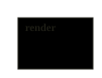

### Module overview

#### CL_Render

_cl · `design/lld/render/CL_Render.puml`_

- traces to: `REQ-00001-1` `REQ-00002-1` `REQ-00003-1` `REQ-00004-1` `REQ-00005-1` `REQ-00006-1` `REQ-00007-1` `REQ-00008-1` `REQ-00009-1` `REQ-00010-1` `REQ-00011-1`
- implemented in: `src/render/cli.ts` · `src/render/engine.ts` · `src/render/filters.ts` · `src/render/frontend.ts` · `src/render/ir.ts` · `src/render/sequence.ts` · `src/render/serve.ts` · `src/render/shared.ts`
- verified by: `tests/cli.test.ts` (1) · `tests/engine.test.ts` (1) · `tests/filters.test.ts` (1) · `tests/frontend.test.ts` (1) · `tests/interactive.test.ts` (2) · `tests/ir.test.ts` (1) · `tests/sequence.test.ts` (3) · `tests/serve.test.ts` (1)

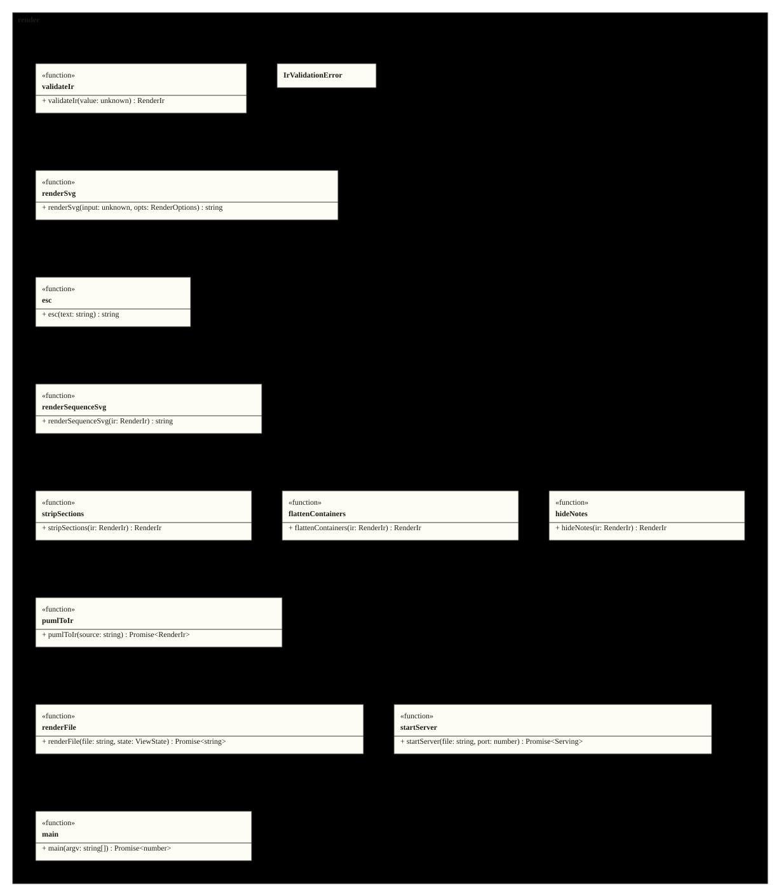

### Class detail

<code>CL_IrModule</code> · traces to <code>REQ-00001-1</code>

<ul>
<li>source: <code>design/lld/render/CL_IrModule.puml</code></li>
<li>implemented in: <code>src/render/ir.ts</code></li>
<li>verified by: <code>tests/ir.test.ts</code> (1)</li>
</ul>

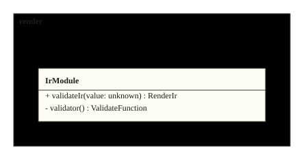

<code>CL_IrValidationError</code> · traces to <code>REQ-00001-1</code>

<ul>
<li>source: <code>design/lld/render/CL_IrValidationError.puml</code></li>
<li>implemented in: <code>src/render/ir.ts</code></li>
<li>verified by: <code>tests/ir.test.ts</code> (1)</li>
</ul>

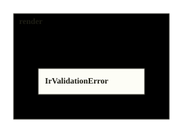

<code>CL_EngineModule</code> · traces to <code>REQ-00002-1</code> <code>REQ-00006-1</code>

<ul>
<li>source: <code>design/lld/render/CL_EngineModule.puml</code></li>
<li>implemented in: <code>src/render/engine.ts</code></li>
<li>verified by: <code>tests/engine.test.ts</code> (1), <code>tests/interactive.test.ts</code> (1)</li>
</ul>

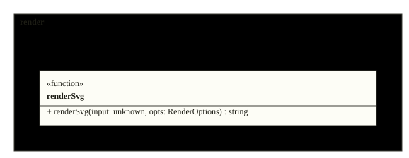

<code>CL_SharedModule</code> · traces to <code>REQ-00002-1</code>

<ul>
<li>source: <code>design/lld/render/CL_SharedModule.puml</code></li>
<li>implemented in: <code>src/render/shared.ts</code></li>
<li>verified by: <code>tests/engine.test.ts</code> (1)</li>
</ul>

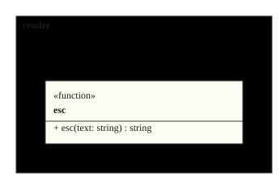

<code>CL_SequenceModule</code> · traces to <code>REQ-00009-1</code>

<ul>
<li>source: <code>design/lld/render/CL_SequenceModule.puml</code></li>
<li>implemented in: <code>src/render/sequence.ts</code></li>
<li>verified by: <code>tests/sequence.test.ts</code> (1)</li>
</ul>

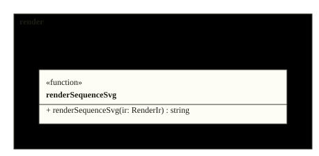

<code>CL_FiltersModule</code> · traces to <code>REQ-00005-1</code>

<ul>
<li>source: <code>design/lld/render/CL_FiltersModule.puml</code></li>
<li>implemented in: <code>src/render/filters.ts</code></li>
<li>verified by: <code>tests/filters.test.ts</code> (1)</li>
</ul>

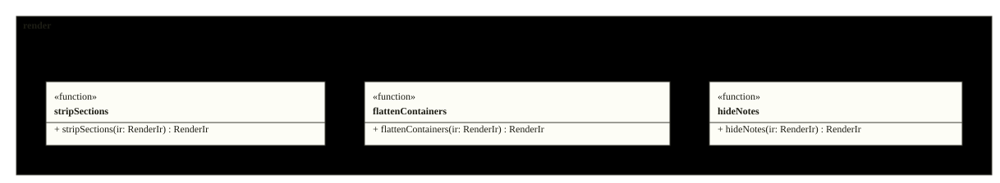

<code>CL_FrontendModule</code> · traces to <code>REQ-00003-1</code> <code>REQ-00007-1</code>

<ul>
<li>source: <code>design/lld/render/CL_FrontendModule.puml</code></li>
<li>implemented in: <code>src/render/frontend.ts</code></li>
<li>verified by: <code>tests/frontend.test.ts</code> (1), <code>tests/interactive.test.ts</code> (1)</li>
</ul>

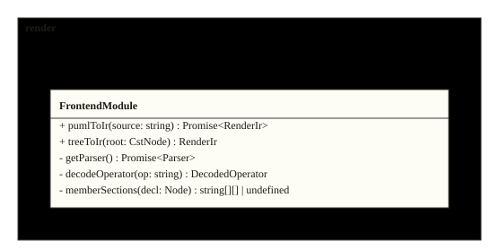

<code>CL_ServeModule</code> · traces to <code>REQ-00011-1</code>

<ul>
<li>source: <code>design/lld/render/CL_ServeModule.puml</code></li>
<li>implemented in: <code>src/render/serve.ts</code></li>
<li>verified by: <code>tests/serve.test.ts</code> (1)</li>
</ul>

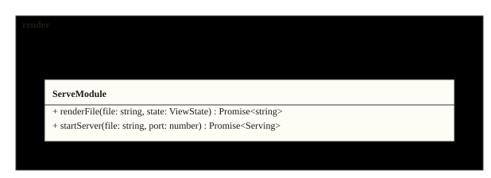

<code>CL_CliModule</code> · traces to <code>REQ-00004-1</code>

<ul>
<li>source: <code>design/lld/render/CL_CliModule.puml</code></li>
<li>implemented in: <code>src/render/cli.ts</code></li>
<li>verified by: <code>tests/cli.test.ts</code> (1)</li>
</ul>

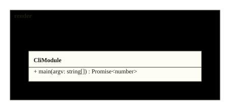

<!-- /folio -->
