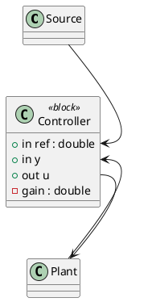
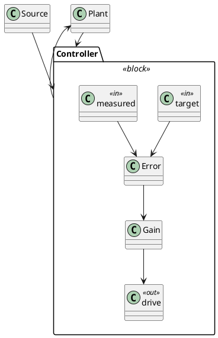

# What plantuml-render draws

plantuml-render turns PlantUML text into deterministic SVG without Java. It
parses with the deriva tree-sitter grammar and draws a standard-driven subset;
whatever it does not model is kept as raw text and drawn as nothing, never as
an error.

## Class diagrams (the core)

- `class`, `abstract class`, `interface`, `enum`, plus `annotation`,
  `exception`, `struct`, `record`, `protocol`. Aliases (`class "X" as Y`).
- Members with visibility `+ - # ~`, `{static}` (underlined) and
  `{abstract}` (italic). Attributes `name : type`, methods
  `name(a: T, b: U) : R`. Types and parameters are syntax-coloured.
- Relations: `--|>` inheritance, `..|>` realization, `*--` composition,
  `o--` aggregation, `..>` dependency, `-->` association; labels after `:`;
  cardinalities in quotes are accepted.
- `namespace` and `package` blocks become containers; dotted names nest
  (`namespace a.b.c`).
- A relation names an entity inside a container by its declared name
  (`A`) or by any qualified tail of it (`o.A`, `inner.o.A` for
  `Top.o.A`). The declared name wins; a tail that two entities share
  names neither, and the relation is reported rather than wired to a
  guess.
- `note left|right|top|bottom of X : text` with `\n` line breaks.
- `class f <<function>>` marks a module-level function (badge `f`).
- `!include file` and `!includesub file!NAME` are expanded before parsing.

## Blocks with boundary ports

A class marked `<<block>>` is drawn the way a block diagram is drawn: its
`in` and `out` members become named squares on its border, and relations
address those squares instead of the box.



- A member reads as a port when it starts with `in` or `out` after the
  optional visibility: `+ in ref`, `out u`. A type after `:` is kept as the
  port's tooltip, since a border square has no room for it.
- `in` ports are drawn on the left edge, `out` ports on the right.
- `Block::port` on either side of a relation wires to that port. The wire
  routes to the square, so the drawing shows which signal goes where rather
  than three arrows into the same box.
- Members that are not ports stay in their compartments, so a block can
  carry parameters (`- gain : double`) beside its signals.
- Everything else is unchanged: without the `<<block>>` stereotype a member
  called `in x` is an ordinary attribute, and no other stereotype triggers
  this reading.

A subsystem — a box with things inside it and a boundary around them — is a
`package` marked `<<block>>`. There is no member syntax inside a package, so
its ports are declared as children marked `<<in>>` or `<<out>>`:



The same name is the port on the outside and the signal on the inside, so a
wire arriving from outside and the wire leaving towards a child meet at the
same square on the border. Children without `<<in>>`/`<<out>>` stay ordinary
boxes, and a container without `<<block>>` reads `<<in>>` as what it is, a
stereotype.

### One output, several destinations

A block whose output drives more than one consumer should say so with a port.
Without one, each relation leaves the box wherever the router finds room, and
a reader counting the lines that leave the box counts outputs that do not
exist:

```plantuml
package System <<block>> {
  class Source <<block>> {
    + out y
  }
  class ConsumerA
  class ConsumerB
  Source::y --> ConsumerA
  Source::y --> ConsumerB
}
```

Every wire written `Source::y` starts at the same square, so the drawing says
one output that branches. This works at any depth — a `<<block>>` class
nested inside a `<<block>>` package is still a block with a boundary.

### Which way the drawing flows

A diagram that declares boundary ports is a block diagram, and it is laid out
in the direction its own ports point: inputs on the west border and outputs on
the east one mean the drawing runs left to right, so a chain of blocks reads
as a chain instead of falling down the page while its wires turn corners to
reach the border. Ports on the north and south borders — which only a
render-IR document can ask for — keep the drawing running downwards. A diagram
with no ports is unaffected.

### Where a port's name is written

A container's port names are written **inside** it, in room the layout reserves
for them before placing anything else. Nested blocks put their borders a few
pixels apart, and names written outwards across that gap land on top of one
another: an outer block's `reference` over an inner block's `setpoint`.

A `<<block>>` class keeps its names outside, above the square. A box is sized
from its own text rather than from children, so there is no spare room inside
it, and outside a box is where nothing else is.

### A long chain wraps

Six subsystems chained left to right are twenty-six times wider than they are
tall, and a drawing that wide is shown scaled to fit: the boxes end up a few
pixels high and their outlines dissolve. A block diagram's chain therefore
wraps into rows, the same way a paragraph wraps, so the drawing grows in both
directions and keeps the scale it is read at. The wire that continues the chain
runs from the end of one row to the start of the next.

### Two limits worth knowing

**`north` and `south` sides are IR-only**: the text syntax says direction, and
direction picks the side. And a relation line cannot start with `ref`, which
the grammar reads as the sequence-diagram keyword — name that port something
else.

### Wire to the port, not to the block

A block that declares a boundary says its signals cross it there, so a relation
names the port:

```plantuml
in1 --> Worker::a1
Worker::r1 --> out1
```

A relation drawn to the block itself lands wherever the router has room, beside
ports left looking unconnected, and the drawing then says something the model
does not. Which port was meant is not something the renderer can know, so it
says which blocks were reached that way and what they offer.

## Relations that say different things along the same line

Twenty transitions between the same two states, each with its own trigger, are
twenty relations in the model and one line on paper. Drawn apart, each takes a
channel of its own and every channel wraps the last: two boxes sixty pixels
apart come out 1813 wide, nested rectangles all the way. Drawn together they
are 146 wide and read at a glance.

So relations that are indistinguishable apart from their text are drawn as one,
with the labels stacked along the line and the explanations behind it. Nothing
the producer said is lost: twenty labels, twenty lines; twenty explanations,
twenty lines of tooltip.

Indistinguishable means all of it: the same two ends, the same kind, the same
dash, the same link. Two relations of different kinds between the same pair
stay two, and so do two that point opposite ways or carry different links. A
sequence message never collapses, because its row is its order.

## When a wire does not appear

A relation is drawn only when both of its ends name something the diagram
declares. When one does not — a misspelled name, a reference to an entity that
another file was supposed to bring in, or `Block::out` on a class that is not a
block and therefore has no ports — the relation cannot be drawn, and the
drawing carries a notice naming what it could not find. A silently missing wire
is the one failure a diagram cannot show you.

## Sequence diagrams

Participants of every kind (`actor` is drawn as a stick figure), `->` and
`-->` messages with labels, self messages, `alt/else`, `loop`, `opt`, `par`
frames with their condition, `== dividers ==`, `note over|left|right`.
Lanes are spaced by what crosses them, frames wrap only the participants
they involve, and rows grow to fit multi-line notes. Frames are strong
outlines in a colour per kind (alt indigo, loop green, opt amber, par
violet), with the keyword on a tab and each condition in a pill; a long
condition wraps inside the tab band instead of stretching the frame; a
frame keeps air above, below and after each `else`, and nested frames
step in 14 px per level.

## Activity diagrams (new syntax)

`start`, `stop`, `end`, `:action;` (multi-line with `\n`), `-> label;`
arrows, `if/elseif/else/endif` with `(condition)` and `(branch)` labels,
`switch/case`, `while ... endwhile` with `is`/`not` labels and `break`,
`repeat ... repeat while` with `backward:action;`, `fork/fork again/end
fork` (bars) and `end merge`, `split/split again/end split`, `kill` and
`detach`, `partition Name { }`, `|Swimlane|` lanes and `note left|right`.
Actions are rounded boxes, decisions diamonds with the condition inside
and the branch labels on the flows, start a dot, stop a bullseye, end a
crossed circle, fork and join black bars. The legacy activity syntax
(`if "test" then`, `-->[label] "action"`) is not drawn.

## Layout

Class diagrams are laid out by ELK's layered algorithm: bases above their
subtypes, containers laid out with their children, edges routed around the
boxes with their labels placed by the router, and the disconnected pieces
of a diagram packed into a grid. Activity diagrams use the same algorithm
top-down; with swimlanes, every lane is a column, the layers still come
from the algorithm and the flows are routed orthogonally through the gaps
between layers (back edges through a channel on the right). The output is
deterministic: the same source always produces the same SVG.

## Not drawn (kept lossless)

State, use case, component, deployment, mindmap, gantt, the legacy
activity syntax and the other non-UML kinds. The source is kept as it is
and the SVG carries a notice naming the kind instead of an empty frame;
the command line repeats the notice on stderr and still exits 0, so a
batch keeps going. A class diagram whose relations only reference
undeclared entities gets the same kind of notice. Render those kinds with
`plantuml.jar`.

## Recommendations for readable output

- One diagram per file; aggregates through `!includesub` of leaf files.
- Declare relations. A box list without edges is a list, not a diagram.
- Keep member lines in the canonical plantuml-fmt style; that is what the
  syntax colouring understands.
